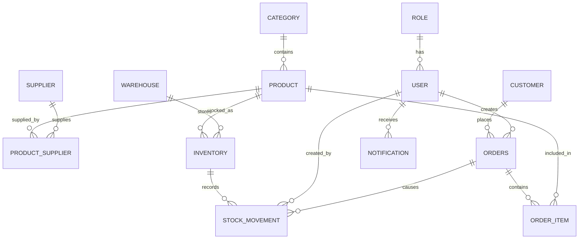

# Database Design

## Entities

1. User
2. Role
3. Product
4. Category
5. Supplier
6. ProductSupplier
7. Warehouse
8. Inventory
9. StockMovement
10. Customer
11. Order
12. OrderItem
13. Notification

---

## Relationships

- Role 1:N User
- Category 1:N Product
- Product N:M Supplier — resolved through ProductSupplier
- Product N:M Warehouse — resolved through Inventory
- Product 1:N Inventory
- Warehouse 1:N Inventory
- Inventory 1:N StockMovement
- Order 1:N StockMovement
- User 1:N StockMovement — `created_by` is optional for system-generated movements
- Customer 1:N Order
- User 1:N Order
- Order 1:N OrderItem
- Product 1:N OrderItem
- User 1:N Notification

---

# Table Design

## 1. roles

| Column | Type | Constraint |
|---|---|---|
| id | BIGINT | PRIMARY KEY |
| name | VARCHAR(50) | NOT NULL, UNIQUE |
| description | VARCHAR(255) | NULL |
| created_at | TIMESTAMP | NOT NULL |
| updated_at | TIMESTAMP | NOT NULL |

---

## 2. users

| Column | Type | Constraint |
|---|---|---|
| id | BIGINT | PRIMARY KEY |
| username | VARCHAR(50) | NOT NULL, UNIQUE |
| email | VARCHAR(100) | NOT NULL, UNIQUE |
| password | VARCHAR(255) | NOT NULL |
| role_id | BIGINT | NOT NULL, FOREIGN KEY → roles.id |
| is_active | BOOLEAN | NOT NULL |
| created_at | TIMESTAMP | NOT NULL |
| updated_at | TIMESTAMP | NOT NULL |

> Passwords will be stored using secure password hashing when Spring Security is implemented.

---

## 3. categories

| Column | Type | Constraint |
|---|---|---|
| id | BIGINT | PRIMARY KEY |
| name | VARCHAR(100) | NOT NULL, UNIQUE |
| description | VARCHAR(255) | NULL |
| created_at | TIMESTAMP | NOT NULL |
| updated_at | TIMESTAMP | NOT NULL |

---

## 4. products

| Column | Type | Constraint |
|---|---|---|
| id | BIGINT | PRIMARY KEY |
| sku | VARCHAR(50) | NOT NULL, UNIQUE |
| name | VARCHAR(150) | NOT NULL |
| description | TEXT | NULL |
| price | DECIMAL(12,2) | NOT NULL |
| reorder_level | INT | NOT NULL |
| category_id | BIGINT | NOT NULL, FOREIGN KEY → categories.id |
| is_active | BOOLEAN | NOT NULL |
| created_at | TIMESTAMP | NOT NULL |
| updated_at | TIMESTAMP | NOT NULL |

---

## 5. suppliers

| Column | Type | Constraint |
|---|---|---|
| id | BIGINT | PRIMARY KEY |
| name | VARCHAR(150) | NOT NULL |
| email | VARCHAR(100) | NULL |
| phone | VARCHAR(20) | NULL |
| address | TEXT | NULL |
| is_active | BOOLEAN | NOT NULL |
| created_at | TIMESTAMP | NOT NULL |
| updated_at | TIMESTAMP | NOT NULL |

---

## 6. product_suppliers

| Column | Type | Constraint |
|---|---|---|
| product_id | BIGINT | PRIMARY KEY, FOREIGN KEY → products.id |
| supplier_id | BIGINT | PRIMARY KEY, FOREIGN KEY → suppliers.id |
| supplier_product_code | VARCHAR(100) | NULL |
| cost_price | DECIMAL(12,2) | NOT NULL |
| created_at | TIMESTAMP | NOT NULL |

> `product_id + supplier_id` form a composite primary key.

> `cost_price` represents the product's cost from a specific supplier and therefore belongs to the ProductSupplier relationship.

---

## 7. warehouses

| Column | Type | Constraint |
|---|---|---|
| id | BIGINT | PRIMARY KEY |
| name | VARCHAR(100) | NOT NULL |
| code | VARCHAR(30) | NOT NULL, UNIQUE |
| address | TEXT | NULL |
| is_active | BOOLEAN | NOT NULL |
| created_at | TIMESTAMP | NOT NULL |
| updated_at | TIMESTAMP | NOT NULL |

---

## 8. inventory

| Column | Type | Constraint |
|---|---|---|
| id | BIGINT | PRIMARY KEY |
| product_id | BIGINT | NOT NULL, FOREIGN KEY → products.id |
| warehouse_id | BIGINT | NOT NULL, FOREIGN KEY → warehouses.id |
| quantity | INT | NOT NULL |
| updated_at | TIMESTAMP | NOT NULL |

---

## 9. stock_movements

| Column | Type | Constraint |
|---|---|---|
| id | BIGINT | PRIMARY KEY |
| inventory_id | BIGINT | NOT NULL, FOREIGN KEY → inventory.id |
| order_id | BIGINT | NULL, FOREIGN KEY → orders.id |
| movement_type | VARCHAR(30) | NOT NULL |
| quantity | INT | NOT NULL |
| reason | VARCHAR(255) | NULL |
| created_by | BIGINT | NULL, FOREIGN KEY → users.id |
| created_at | TIMESTAMP | NOT NULL |

---

### Movement Types

```text
STOCK_IN
STOCK_OUT
ADJUSTMENT```

---

## 10. customers

| Column | Type | Constraint |
|---|---|---|
| id | BIGINT | PRIMARY KEY |
| name | VARCHAR(150) | NOT NULL |
| email | VARCHAR(100) | NULL |
| phone | VARCHAR(20) | NULL |
| address | TEXT | NULL |
| created_at | TIMESTAMP | NOT NULL |
| updated_at | TIMESTAMP | NOT NULL |

---

## 11. orders

| Column | Type | Constraint |
|---|---|---|
| id | BIGINT | PRIMARY KEY |
| order_number | VARCHAR(50) | NOT NULL, UNIQUE |
| customer_id | BIGINT | NOT NULL, FOREIGN KEY → customers.id |
| status | VARCHAR(30) | NOT NULL |
| total_amount | DECIMAL(12,2) | NOT NULL |
| created_by | BIGINT | NOT NULL, FOREIGN KEY → users.id |
| created_at | TIMESTAMP | NOT NULL |
| updated_at | TIMESTAMP | NOT NULL |

---

### Order Statuses

```text
PENDING
CONFIRMED
PROCESSING
COMPLETED
CANCELLED```

---

## 12. order_items

| Column | Type | Constraint |
|---|---|---|
| id | BIGINT | PRIMARY KEY |
| order_id | BIGINT | NOT NULL, FOREIGN KEY → orders.id |
| product_id | BIGINT | NOT NULL, FOREIGN KEY → products.id |
| quantity | INT | NOT NULL |
| unit_price | DECIMAL(12,2) | NOT NULL |
| subtotal | DECIMAL(12,2) | NOT NULL |

---

## 13. notifications

| Column | Type | Constraint |
|---|---|---|
| id | BIGINT | PRIMARY KEY |
| user_id | BIGINT | NOT NULL, FOREIGN KEY → users.id |
| type | VARCHAR(50) | NOT NULL |
| title | VARCHAR(150) | NOT NULL |
| message | TEXT | NOT NULL |
| is_read | BOOLEAN | NOT NULL |
| created_at | TIMESTAMP | NOT NULL |

---

### Notification Types

```text
LOW_STOCK
ORDER_CREATED
STOCK_RECEIVED```

---

## Additional Database Constraints

The following constraints should be applied in addition to the primary key, foreign key, `NOT NULL`, and `UNIQUE` constraints defined for each table.

### 1. Products

```sql
CHECK (price >= 0)
CHECK (reorder_level >= 0)```

### 2. Inventory

```sql
CHECK (quantity >= 0)
UNIQUE (product_id, warehouse_id)```

### 3. Stock Movements

```sql
CHECK (quantity > 0)
CHECK (movement_type IN ('STOCK_IN', 'STOCK_OUT', 'ADJUSTMENT'))```

### 4. Orders

```sql
CHECK (total_amount >= 0)
CHECK (status IN (
    'PENDING',
    'CONFIRMED',
    'PROCESSING',
    'COMPLETED',
    'CANCELLED'
))```

### 5. Order Items

```sql
CHECK (quantity > 0)
CHECK (unit_price >= 0)
CHECK (subtotal >= 0)```

### 6. Product Suppliers

```sql
PRIMARY KEY (product_id, supplier_id)
```

## Entity Relationship Diagram

